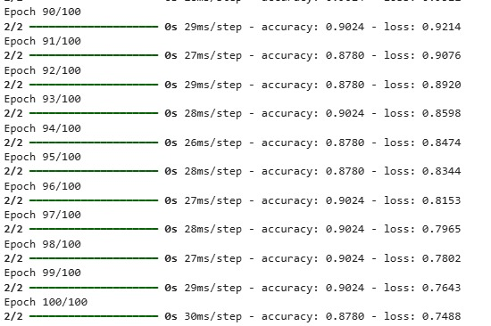

# LSTM-Text-Generation
# 🎬 LSTM Text Generation – Movie Dialogue Generator

## 📌 Project Overview

This project demonstrates **Text Generation using LSTM (Long Short-Term Memory)** networks.
The model is trained on **movie-style dialogues** to predict and generate the next words in a sentence.

---

## 🎯 Objective

To build a deep learning model that can generate meaningful movie-like dialogues using **sequence learning with LSTM**.

---

## 🧠 Model Details

* Model Type: LSTM (Recurrent Neural Network)
* Embedding Layer for word representation
* Trained on small movie dialogue dataset
* Predicts next word based on input sequence

---

## 📂 Project Structure

```
LSTM-Text-Generation/
│
├── lstm_text_generation.ipynb
├── README.md
├── training.png
└── image.png
```

---

## ⚙️ Installation

```bash
pip install tensorflow numpy
```

---

## ▶️ How to Run

1. Open the notebook in Google Colab
2. Run all cells step-by-step
3. Train the LSTM model
4. Generate text using seed input

---

## 🗂️ Dataset Sample

i will be back
may the force be with you
you talking to me
i am your father
hasta la vista baby
why so serious
i feel the need for speed
you cant handle the truth
ill make him an offer he cant refuse
keep your friends close but enemies closer

---

## 🏋️ Training Process



---

## 🖼️ Generated Output


---

## 📊 Results

* Model successfully learned sentence patterns
* Generated meaningful movie-style dialogues
* Training accuracy improved over epochs
* Demonstrates effective sequence learning using LSTM

---

## 🚀 Future Improvements

* Use larger dataset (e.g., full movie scripts)
* Increase model complexity (BiLSTM / GRU)
* Deploy as chatbot or web app

---


Your Name

